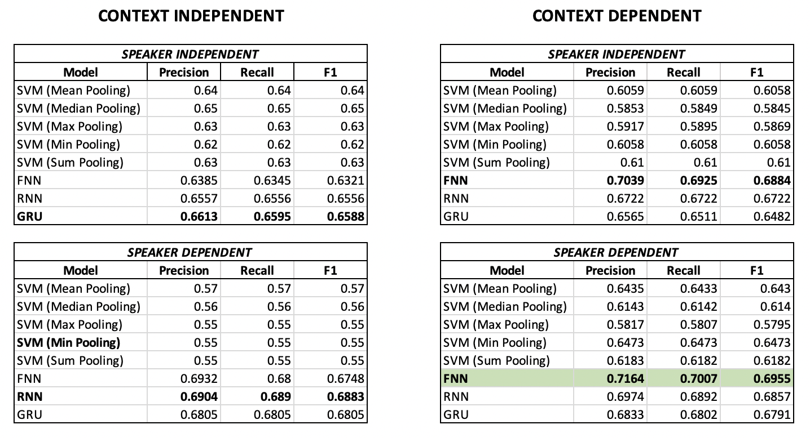
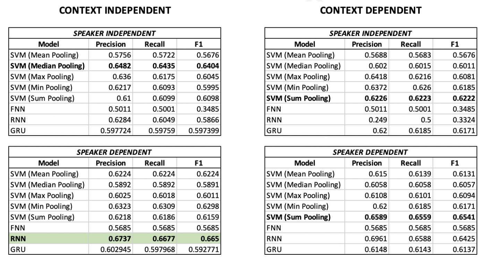

# multimodal_sarcasm_classification

Results until now

Audio Modality 

Video Modality 

References:

Santiago Castro, Devamanyu Hazarika, Verónica Pérez-Rosas, Roger Zimmermann, Rada Mihalcea, and Soujanya Poria. 2019. Towards Multimodal Sarcasm Detection (An _Obviously_ Perfect Paper). In Proceedings of the 57th Annual Meeting of the Association for Computational Linguistics, pages 4619–4629, Florence, Italy. Association for Computational Linguistics.

Anupama Ray, Shubham Mishra, Apoorva Nunna, Pushpak Bhattacharyya (2022) A multimodal corpus for emotion recognition in sarcasm, arXiv.org. Available at: https://arxiv.org/abs/2206.02119
